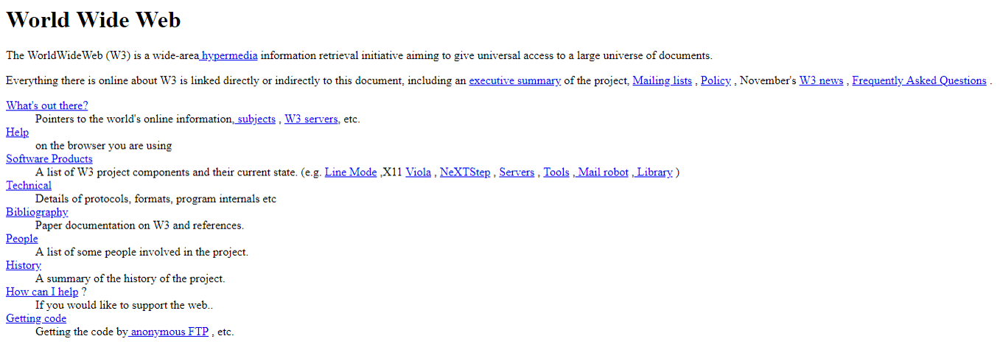
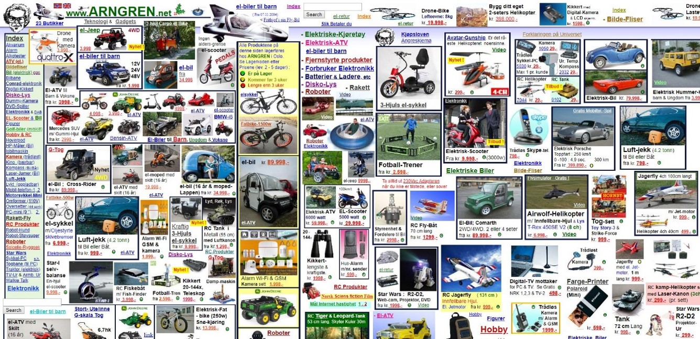
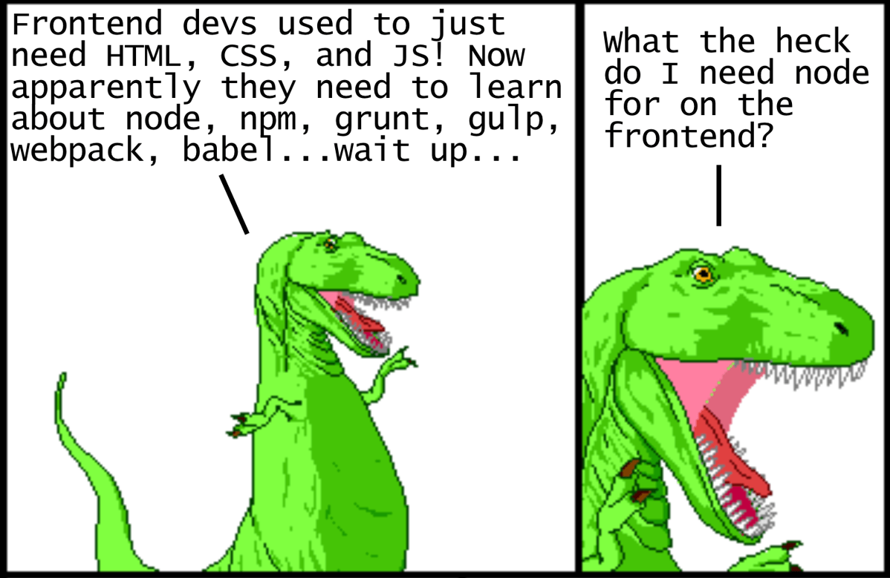
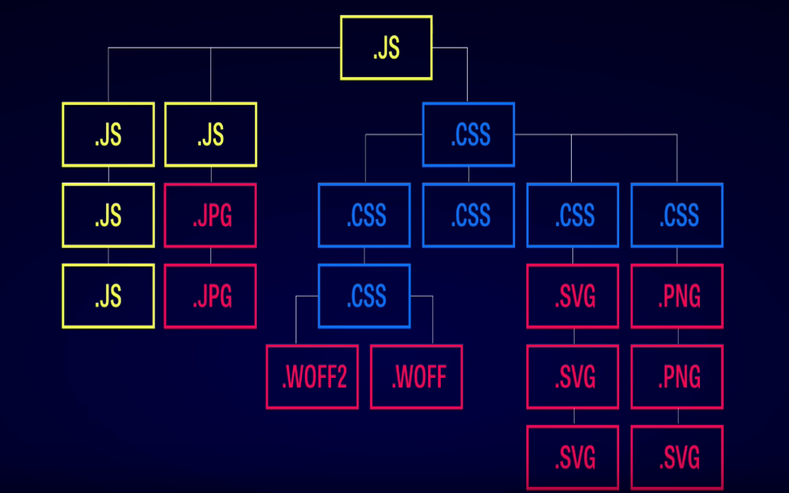
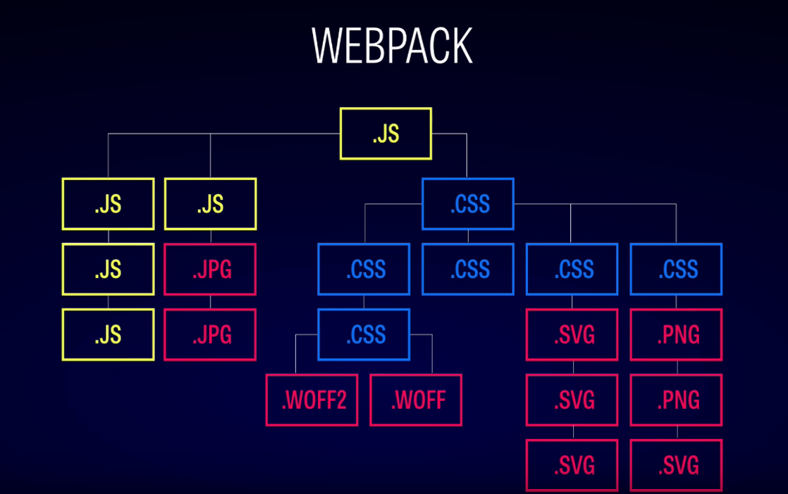
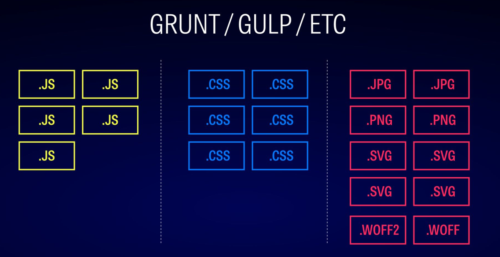

export { infobip as theme } from './themes'

import { Appear } from 'mdx-deck'
import { CodeSurfer } from "mdx-deck-code-surfer"
import Code from 'mdx-code';
import { Invert } from 'mdx-deck/layouts'


# Introduction to Packing and Building Apps with Webpack 4
### Ante Tomic, .NET Software Engineer (Infobip)
### http://bit.ly/WebpackDotNetMeetup
---

## How did everything start?
<Appear>
  <div style={{
    float: 'left',
    left: 0,
    width: '50%',
  }}>
    
  </div>
  <div style={{
      float: 'left',
      width: '50%',
  }}>
    
  </div>
  <div style={{
      float: 'left',
      width: '50%',
  }}>
    
  </div>
</Appear>

```notes
From early 90s -> first website with only HTML. First JavaScript, then CSS and we got the websites like one on the right. There was successes and failures, but advancement of Web allowed us to have not web pages, but web applications.
```

---

import { Image } from 'mdx-deck'

# Today's issues?



```notes
Mention issues present today. Even thought we have a lot of options for web management, we have issues like a lot of files, order of adding stylesheets and scripts into HTML, file optimization and more. We have most popular solution for that - Webpack.
```

---

## Webpack (2012 - ...)

<div style={{
  textAlign: 'center'
}}>
  
</div>

<div style={{
  width: '100%'
}}>
  <span style={{
    fontSize: '4.2vmin',
    color: '#a5a5a5'
  }}>
    Tobias Koppers, Sean Larkin, Johannes Ewald, Juho Vepsäläinen, Kees Kluskens and Webpack contributors
  </span>
</div>

```notes
Webpack -> module bundler -> prepares files to include everything necessary for opening a web page. 
It takes entry files, processes them and checks what does bundle need and which file types need to be processed. 
Because of that, it knows what is necessary first and everything is automatic. Example from pic
```

---

# Sample project

<Appear>
  <div style={{
    textAlign: 'right',
    float: 'left',
    width: '20vw',
    marginRight: '2vw',
    marginBottom: '6vh',
  }}>
    
  </div>
  <div style={{
    textAlign: 'left',
    float: 'left',
    width: '15vw',
    marginBottom: '6vh',
  }}>
    
  </div>
  <div>
    <pre style={{
      display: 'unset'
    }}>
      <code>npm init -y</code>
    </pre>
  </div>
</Appear>


```notes
Node.JS -> because of simplicity, environment which allows running JavaScript on backend, available everywhere including .NET
We will create a Node.JS application. Create folder, open console, npm init -y (no answering questions, quickly creating and skipping questions)
```

---

# Starting with project

```
npm i webpack webpack-cli -D
```
* What else?

<Appear>
  <div
    style={{
      textAlign: 'center'
    }}
  >
    
  </div>
</Appear>

```notes
What else do we need to do? First we need to call npm install or shorter npm i, write libraries we want to install and write if we wanna add to dependencies or devDependencies.
Here we need to install webpack which is the main NPM library which contains everything necessary for Webpack and webpack-cli which contains all Webpack CLI commmands.
What else do we need? Apart from code example, nothing. :) So, that's it, we're done for today and time for pizza haha. Just kidding, let's see the example. :)
```

---

import { infobipCode } from './themes'


<CodeSurfer
  title="html-webpack-plugin"
  theme={infobipCode}
  code={require("!raw-loader!./webpack-snippets/01-html.js")}
  showNumbers
  steps={[
    { notes: 'Adding the html-webpack-plugin' },
    { notes: 'Create webpack.config.js file (wherever package.json is)!' },
    { lines: [1], notes: 'Before this: npm i -D html-webpack-plugin!' },
    { lines: [4, 8], notes: 'All plugins we use go under plugins' },
    { range: [5, 7], notes: 'Defining the html-webpack-plugin' },
  ]}
/>

```notes
1) Html-webpack-plugin
2) We have to add webpack.config.js file because we have to configure this. Webpack automatically looks for webpack.config.js file in root folder of project wherever package.json is.
3) Installing dependency
3) All plugins are under plugins
4) Now defining html-webpack-plugin, here we need only title right now
```

---

# webpack-dev-server

```
npm i webpack-dev-server -D
```

And then update _package.json_:

```json
  "scripts": {
    "start": "webpack-dev-server --mode development",
    "build": "webpack --mode production"
  },
```

---

<CodeSurfer
  title="Or we can modify webpack-dev-server a little bit :)"
  code={require("!raw-loader!./webpack-snippets/02-webpack-dev-server.js")}
  showNumbers
    steps={[
    { notes: 'We are returning to webpack.config.js ...' },
    { range: [9, 14], notes: 'Adding the devServer property' },
    { lines: [10], notes: 'Which errors we want to see!' },
    { lines: [11, 12], notes: 'Host/Port values from process.env (or defaults if not defined)' },
    { lines: [13], notes: 'Opening our application in browser on application start ...' },
  ]}
/>

```notes
1) Returning to webpack.config.js
2) Adding devServer property which contains all info for setting up the development server
3) Recommended to define which errors we want to see
4) Now defining the process.env variables or default if not available
5) Defining if we want our application to open in browser when we write npm start
```

---

# Compiling modern JavaScript
* Babel
```
npm i @babel/core babel-loader @babel/preset-env -D
```
* Let's modify Webpack configuration

```notes
So, as we saw, const is not transformed to new JavaScript syntax. The issue is that Webpack can transpile only some of ES2015 code, but what about newer code syntax? How to handle that? We need Babel for that, so we need to first install @babel/core which is core Babel package which constains the most essential parts, babel-loader which is Babel's loader for transpiling code in Webpack and @babel/preset-env which contains everything for transpiling all of JavaScript's newer syntax.
```

---

<CodeSurfer
  title="And now let's add Babel!"
  code={require("!raw-loader!./webpack-snippets/03-adding-babel.js")}
  showNumbers
    steps={[
    { notes: 'We are returning to webpack.config.js' },
    { lines: [2], notes: 'Defining necessary imports' },
    { lines: [5, 6, 19, 20], notes: 'Adding module property inside which we are defining rules for compiling the files' },
    { range: [7, 18], notes: 'Telling Webpack how to compile JavaScript' },
    { lines: [8], notes: 'Regex to regcognize which files to compile' },
    { lines: [9], notes: 'Optimizing build by including/excluding only specific folders' },
    { range: [10, 17], notes: 'Defining used loaders' },
    { lines: [11], notes: 'Which loader?' },
    { range: [12, 16], notes: 'Defining loader options (here we are making compiling newer JavaScript possible)' },
  ]}
/>

```notes
1) Returning to Webpack config
2) Imports (mention we have to do that whenever we use something not in string)
3) Module --> rules - We will define rules for compiling different file types
4) Defining how to compile JavaScript
5) Regex to recognize necessary files, in this case any js or jsx files
6) Includes/Excludes which can help speed up development by telling which folders need to be checked
7) Defining which loaders to uzse
8) Since we installed Babel, we will use babel-loader
9) Any additional options, here we wanna make all JavaScript syntax options available
```

---

<!-- <CodeSurfer
  title="What about IE11, etc.? Polyfills!"
  code={require("!raw-loader!./webpack-snippets/04-adding-polyfills.js")}
  showNumbers
    steps={[
    { notes: 'First install core-js: npm i -D core-js' },
    { notes: 'Now we are returning to webpack.config.js ...' },
    { range: [13, 18], notes: 'Changing @babel/preset-env' },
    { range: [14, 16], notes: 'Using browserslist to define which browsers should be supported' },
    { lines: [17], notes: 'Telling Webpack to automatically include only polyfills necessary for opening a page' },
  ]}
/>

```notes
1) Intalling core-js which contains polyfills, Babel needs it for babel-polyfill
2) Returning to Webpack configuration
3) Replacing @babel/preset-env with an array of options, second object parameter contains options
4) First we are using browserslist where we can define which browsers should be supported
5) Then with useBuiltIns we tell Webpack to automatically include only necessary polyfills
```

--- -->

<CodeSurfer
  title="Adding styles"
  code={require("!raw-loader!./webpack-snippets/05-css-and-styles.js")}
  showNumbers
    steps={[
    { notes: 'Again back to webpack.config.js ...' },
    { range: [20, 24], notes: 'Adding new rule under module -> rules' },
    { lines: [21, 22], notes: 'Usual ... :)' },
    { lines: [23], notes: 'Now this is new, 2 loaders!' },
    { tokens: { 23: [6, 7, 8] }, notes: "First we take code and make it readable with css-loader ..." },
    { tokens: { 23: [3, 4, 5] }, notes: "Then we take transpiled code and turn it into HTML's style tag!" },
    { lines: [23], notes: 'This basically means style(css(CODE)), like LIFO!' },
  ]}
/>

```notes
1) Returning to Webpack config
2) We are adding the new rule we will use for CSS and where we will check only styles folder
3) Like you can see in this step, we are doing what we have just mentioned
4) But we have the new situation we didn't have before - 2 loaders
5) Basically we are using something similar to LIFO. First we need to take code and make it readable by using css-loader
6) And then we take that code and paste it into HTML as style tag
7) And as I said, this is basically like doing LIFO because last loader added to the list is first one executed
```

---

<!-- <CodeSurfer
  title="Extracting and optimizing CSS"
  code={require("!raw-loader!./webpack-snippets/06-extracting-css.js")}
  showNumbers
    steps={[
    { notes: 'Back to webpack.config.js ... install mini-css-extract-plugin and optimize-css-assets-webpack-plugin' },
    { lines: [23, 24, 25, 33, 34, 35], notes: 'Let\'s modify extracting first!' },
    { lines: [2], notes: 'Adding the dependency first ...' },
    { lines: [25], notes: 'And mini-css-extract-plugin\'s loader instead of style-loader' },
    { lines: [33, 34, 35], notes: 'And then we are adding new plugin where we can define options (we need only filename)' },
    { lines: [3], notes: 'Now let\'s optimize CSS! Adding the dependency first again ...' },
    { lines: [37, 40], notes: 'And now adding new property: optimization!' },
    { lines: [38, 40], notes: 'Since we are minimizing files, we need minimizer property ...' },
    { range: [37, 41], notes: 'And we only need to tell Webpack to optimize files!' },
  ]}
/>

```notes
1) Returning to Webpack config
2) First we will extracting CSS into the separate CSS file we will include
3) As usual, we are first including the necessary dependency
4) And we are replacing style-loader with mini-css-extract-plugin's loader
5) After that, we have to include mini-css-extract-plugin's plugin where we define the necessary settings, in this case we need only the filename.
6) And now we need to minimize the CSS for production and as usual, we need to include the necessary dependency
7) We are also defining the new property: optimization
8) And since we are minimizing the files, we need minimizer property
9) Also, we don't need any additional settings, so we just need to tell Webpack to optimize files and it will automatically do that.
```

--- -->

<CodeSurfer
  title="Loading files"
  code={require("!raw-loader!./webpack-snippets/07-loading-files.js")}
  showNumbers
    steps={[
    { notes: 'Again back to webpack.config.js ...' },
    { range: [27, 38], notes: 'We are adding the new rule for images!' },
    { lines: [28, 29], notes: 'This is already quite usual' },
    { lines: [31], notes: 'We are using url-loader to load images, bue let\'s check why!' },
    { range: [32, 36], notes: 'As usual, we are passing the list of options' },
    { lines: [33], notes: 'File < 10000 bytes ? url-loader : fallback loader (default: file-loader)' },
    { lines: [45, 46, 47], notes: 'First, let\'s remember that CSS is saved in folder, not in root like JS!' },
    { lines: [34], notes: 'In this case, we assume that our project will have images in CSS, ' },
    { lines: [34], notes: 'So we define public path which will be appended before our file' },
    { lines: [35], notes: 'And at the end we assign desired name ... :)' },
    { notes: 'Let\'s first look at the file ...' },
  ]}
/>

```notes
1) Returning to Webpack config
2) After adding CSS, we now need to define what should Webpack do with images
3) As usual, we are first defining the file regex and includes/excludes
4) The loader we will use is url-loader and let's check why we are not using file-loader
5) This depends on options we are passing and there are several useful
6) We are defining the limit for when will loader use url-loader. If file is higher than the limit, fallback loader will be used which is url-loader in this case
7) But before we run this configuration, let's remember that CSS is not saved in same folder as JavaScript files
8) And for simplicity, let's assume that all images will be in CSS
9) So, we will define publicPath as being one level up, so that necessary images can be linked inside of CSS
10) And then at the end, we define which name we want
```

---

# Did anyone else notice in the beginning that configuration in 1 file is getting quite lengthy, how can we sort this out?

---

# Configuration splitting
* DRY (Don't Repeat Yourself)
* webpack-merge
* Let's check 2 examples (here and in project)

---

export default Code;

```javascript EXAMPLE: webpack-merge
const merge = require('webpack-merge');

merge( { a: [1], b: 5, c: 20, e: {i: 25} }, { a: [2], b: 10, d: 421, e: {j: 28} } );
```

---

<!-- <CodeSurfer
  title="Splitting code"
  code={require("!raw-loader!./webpack-snippets/08-splitting-chunks.js")}
  showNumbers
    steps={[
    { notes: 'Let\'s add a few new common parts for adding with webpack-merge ...' },
    { range: [1, 14], notes: 'First let\'s add splitting chunks.' },
    { range: [16, 25], notes: 'And then we can define entry points and output to test this out :)' },
    { lines: [31], notes: 'And in HTML Webpack Plugin we can define which chunks should be used' },
  ]}
/>

```notes
1) There are a lot more things we can add to Webpack
2) One of the most common parts is splitting chunks which is new version of CommonsChunkPlugin from Webpack 3.
We are adding the new property inside optimization called splitChunks. We are first saying to split all common parts available on build  time.
Then we are defining what groups we want to use. We are simple here, we want file called vendors with everything from node_modules.
3) First we are defining entry points in way we define which file names we want and which files we want to include.
Then we define output where we say where should our files be saved and which filename should be used.
4) And then at the end wer should just control what should our HTML file contain and we can do that by defining which chunks to use.
```

--- -->

# Why should i use webpack when I have Grunt and Gulp which can do the same thing?

---

export default Invert


---

export default Invert



---

export default Invert



---

## Parcel vs. Webpack?
### When to use each one?
* Development time, complexity, support?

<div style={{
  float: 'left',
  left: 0,
  width: '40vw',
  marginTop: '16vh'
}}>
  
</div>
<div style={{
  float: 'left',
  width: '40vw',
}}>
  
</div>

---

<div style={{
  float: 'left',
  left: 0,
  width: '42vw',
  color: 'green',
  fontSize: '4.6vmin',
}}>
  <span style={{
    fontSize: '9vmin',
  }}>😀👍</span>
  <ul>
    <li>Customizeable</li>
    <li>Good documentation</li>
    <li>No worrying about „including all possible dependencies”</li>
    <li>Can optimize everything</li>
    <li>Big community</li>
  </ul>
</div>
<div style={{
  float: 'left',
  width: '42vw',
  color: 'darkred',
  fontSize: '4.6vmin',
}}>
  <span style={{
    fontSize: '9vmin',
  }}>🙄👎</span>
  <ul>
    <li>Gets the rep for being „too complicated”</li>
    <li>Supports only ES2015 out of the box</li>
    <li>Requires configuration in most cases</li>
    <li>Some of the features trickier to set up</li>
  </ul>
</div>

---

<div style={{
    fontSize: '12vmin',
    marginBottom: '6vh',
    textAlign: 'center'
  }}>👏👏👏🙇</div>
<div style={{
    fontSize: '8vmin',
    marginBottom: '8vh',
  }}>Thank you! Any questions?</div>
<div style={{
    fontSize: '8vmin',
    marginBottom: '8vh',
    color: 'dimgrey'
  }}>A.Tomic@infobip.com</div>

---